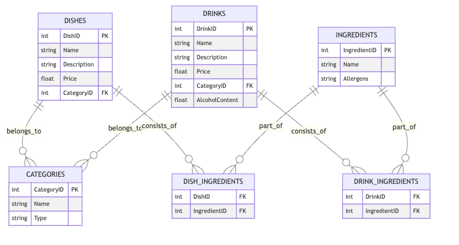

# Restaurant Menu Database

## Introduction
Welcome to my portfolio project for CS103: Databases! In this project, I have created a comprehensive database that models a restaurant menu, featuring a detailed schema for dishes, drinks, and their ingredients. The database provides a structured way to maintain and query restaurant data using PostgreSQL.

## Entity Relationship Diagram
Below is the Entity Relationship Diagram (ERD) that represents the structure of the database:



## How To Use
The database is designed to be interacted with using SQL queries. Users can perform a variety of operations, such as:

- Querying dishes and drinks menus
- Adding new dishes, drinks, and ingredients
- Updating prices and descriptions
- Maintaining the database to ensure data integrity and performance

## Prerequisites
To utilize this database, you will need:

- PostgreSQL installed on your system. You can download it from [the official PostgreSQL website](https://www.postgresql.org/download/).
- A PostgreSQL client like `psql` or a GUI tool like `PgAdmin` to run SQL commands.

## Installation and Setting Up the Database
1. Clone the repository to your local machine.
2. Navigate to the directory containing the SQL schema file.
3. Use the `psql` command-line tool to create a new database:
    ```sh
    psql -U username -c "CREATE DATABASE restaurant_db;"
    ```
4. Connect to the database:
    ```sh
    psql -U username -d restaurant_db
    ```
5. Run the SQL schema file to set up the tables:
    ```sh
    \i path_to_schema_file.sql
    ```
6. Insert initial data using the provided SQL insert statements.

## Features and Objectives
- **Entity-Relationship Diagram (ERD)**: Developed a clear and concise ERD to model the relationships between dishes, drinks, and ingredients.
- **Database Schema**: Translated the ERD into a relational schema using PostgreSQL.
- **Data Normalization**: Applied normalization rules to ensure the database is free of redundancy and update anomalies.
- **Data Insertion**: Populated the database with sample menu items.
- **Database Maintenance**: Utilized PostgreSQL features like VACUUM and ANALYZE for regular maintenance.
- **Security**: Discussed approaches to protect the database, such as using role-based access control.

## Technologies and Concepts Used
- **PostgreSQL**: The project's database management system.
- **SQL**: Utilized for schema creation, data manipulation, and querying.
- **Database Design**: Principles of database schema design and normalization.
- **Database Maintenance**: Techniques for maintaining database performance and integrity.

## Code Structure
The project includes the following SQL files:
- `schema.sql`: Contains the database schema definition.
- `insert_data.sql`: Sample data insertions for initial database setup.
- `queries.sql`: Example queries to retrieve and manipulate data.

## Conclusion
This project encapsulates the practical application of database design and management principles. It serves as a template for a real-world restaurant menu database and provides an excellent example of how databases can be structured and managed.
